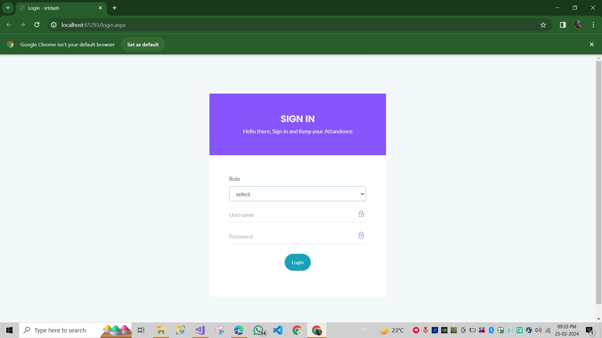
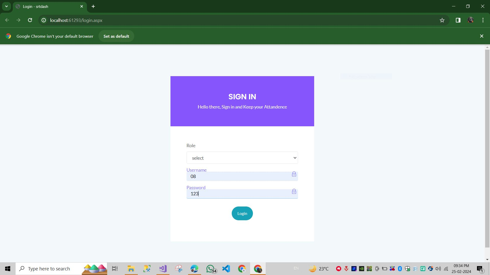
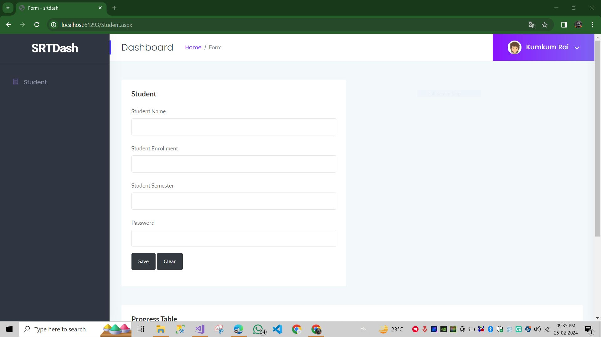
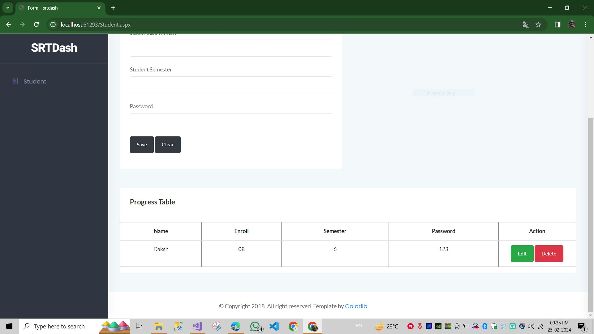
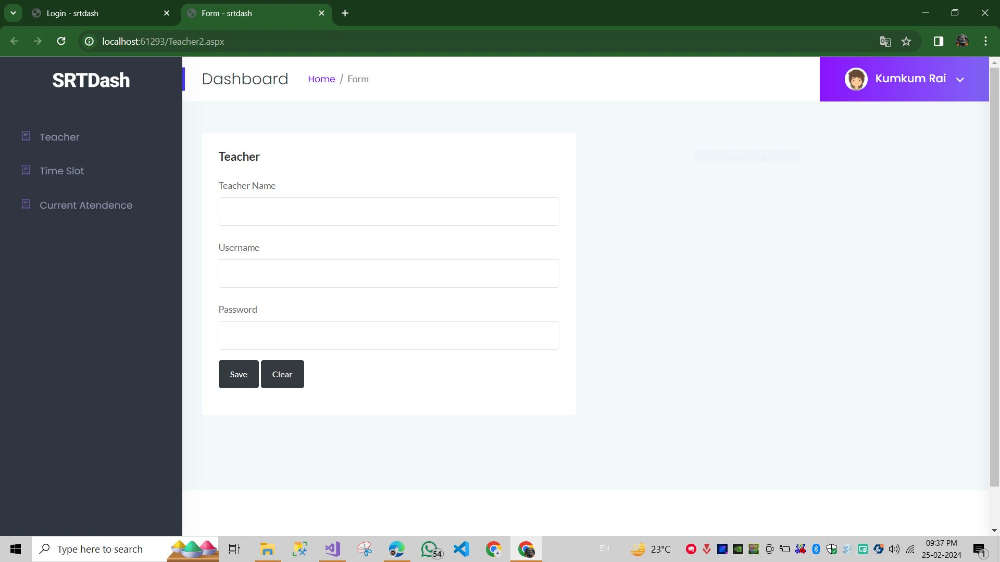
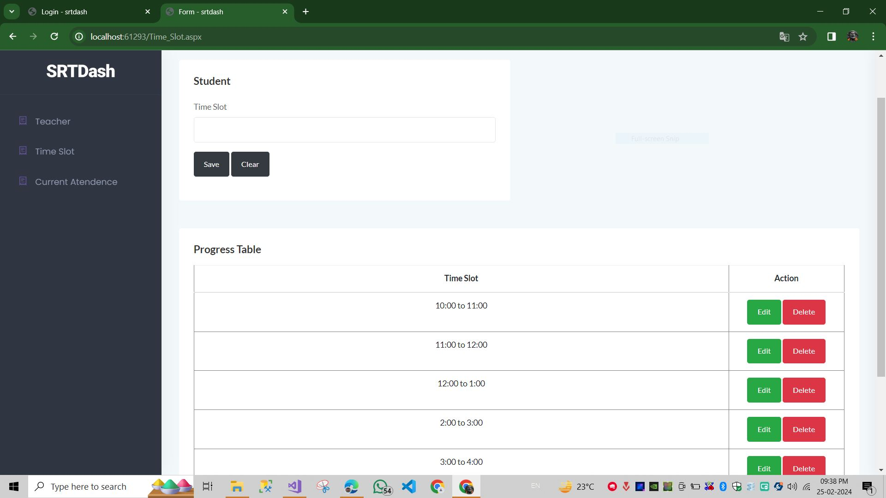
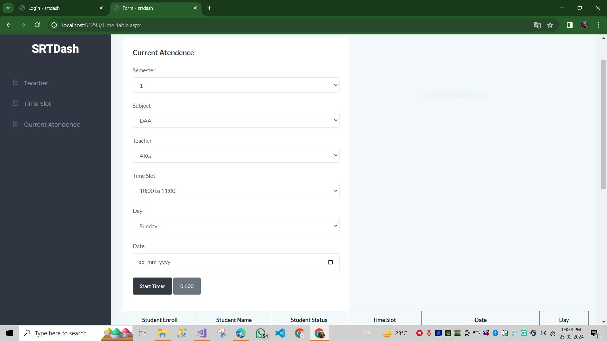
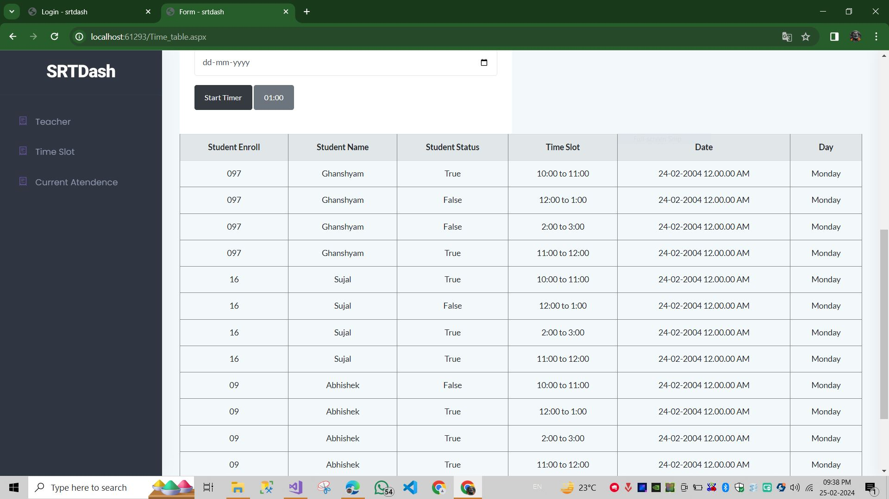

# WiFi-Based Classroom Attendance System

## Introduction
The WiFi-based classroom attendance system is a modern solution designed to streamline the process of taking attendance in educational institutions. Leveraging wireless technology, this system offers efficiency and accuracy while minimizing the administrative burden on teachers.

## Key Features
1. **Wireless Connectivity:** Utilizes existing WiFi infrastructure for secure data transmission.
2. **Automatic Attendance Capture:** Captures attendance as students enter the classroom premises.
3. **Real-Time Data Updates:** Attendance records are updated instantly for administrators and instructors.
4. **Customizable Reporting:** Generates detailed attendance reports based on various parameters.
5. **Integration Capabilities:** Seamless integration with existing student information and learning management systems.
6. **Security and Privacy:** Implements robust security measures to safeguard attendance data.

## Advantages
1. **Time Efficiency:** Saves valuable class time with automated attendance processes.
2. **Accuracy:** Provides reliable and precise attendance records, eliminating manual errors.
3. **Enhanced Student Engagement:** Enables instructors to focus more on teaching and engaging with students.
4. **Data-Driven Insights:** Access to real-time attendance data facilitates informed decision-making.
5. **Ease of Use:** User-friendly interface promotes widespread adoption and acceptance.

## Conclusion
The WiFi-based classroom attendance system represents a modern approach to attendance management, offering efficiency, accuracy, and convenience for educational institutions. By harnessing the power of wireless technology, this system not only simplifies administrative tasks but also contributes to a more dynamic and engaging learning environment.

